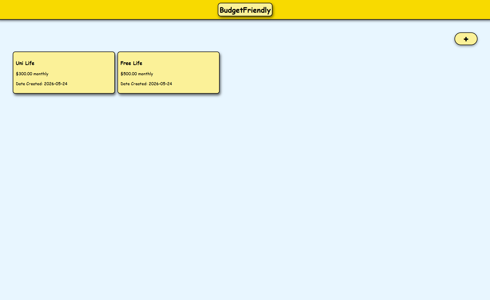
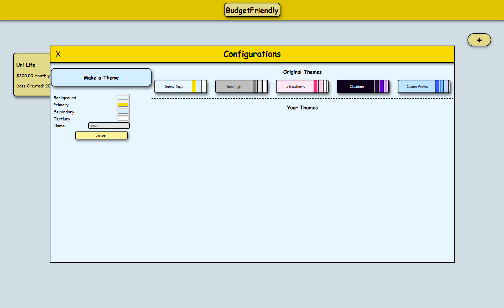
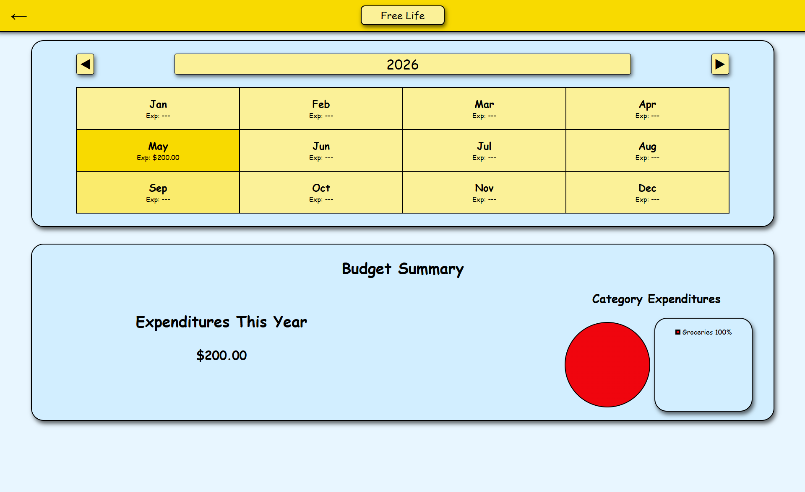
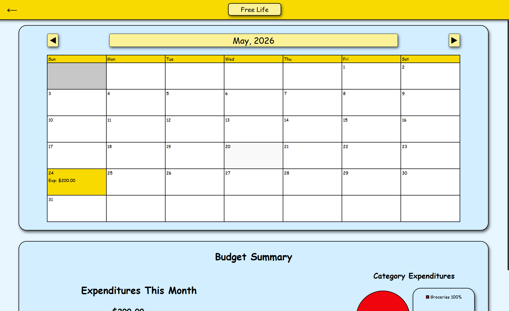
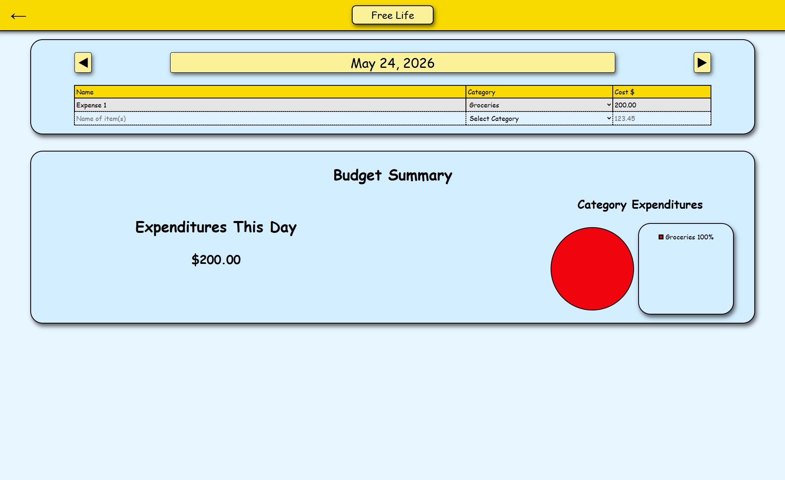

# BudgetFriendly

An offline personalized budget tracker with a simplistic design that significantly reduces the amount of tools, keeping only the minimum yet necessary ones. 

## Screenshots

## Features
* Multiple budget sheets to separate different finance management
* Various periods to select from for a more personalized experience
* Add, edit, and remove categories that can be applied to entries
* Calendar view
  * Shows expenses for each month in the year selected
  * Shows expenses for each day within the month selected
* Summary section
  * View total spent depending on date
  * Visuals (pie chart) accompanied by a colour coded legend.
* Configuration
  * Themes
    * Original themes provided by me
    * Custom themes that the user can create
* Deleting sheets, themes, and entries
  * Right click
 
## Installation
Download the latest version from the Releases page:

- Windows: `Setup.exe`
- macOS: `.dmg`
- Linux: `.AppImage`

### Windows
1. Download the `.exe`
2. Run the installer
3. Open BudgetFriendly from Start Menu

### Linux
1. Download the `.AppImage`
2. Run:
   chmod +x BudgetFriendly.AppImage
3. Execute it

### macOS
1. Download the `.dmg`
2. Drag BudgetFriendly into Applications
3. Open it (you may need to right-click → Open first time)

## Troubleshooting
### App won’t open on macOS
Right-click → Open (first launch security warning)

### Windows SmartScreen warning
Click “More info” → “Run anyway”

## Tech Stack
* Electron-vite
* SQLite (better-sqlite3)
* Node.js
* HTML, CSS, JS
